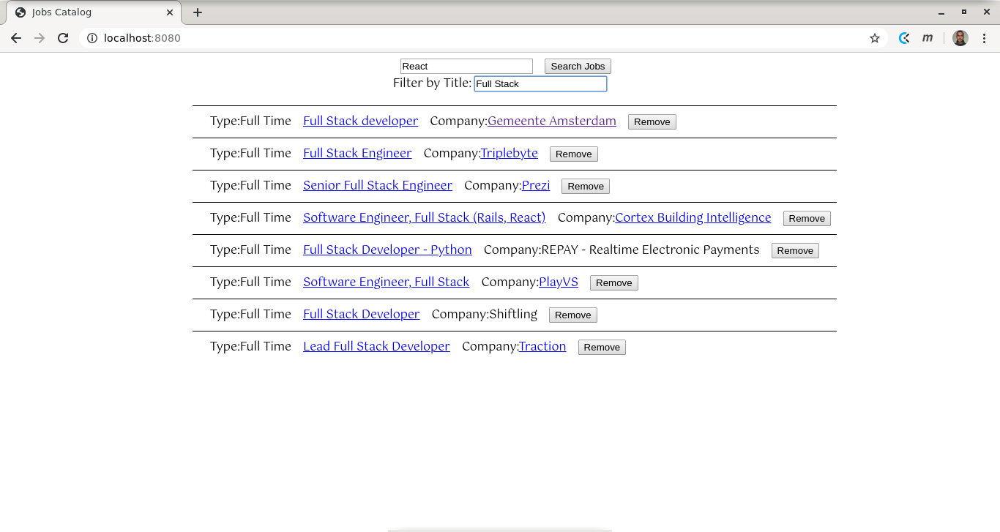

# JOBS CATALOG



## LIVE VERSION

[JOBS CATALOG](https://jobs-catalog.herokuapp.com/)

## ABOUT THIS PROJECT

This project is a SPA (Single-Page App) which works as an interface for using the GitHub Jobs API. In order to set this up in your local machine, you'll need [Node.js®](https://nodejs.org/) installed, clone this repository and use the following commands to run the server inside the repository root folder:

```
git checkout capstone-project
npm install
npx webpack --config webpack.config.js
node server.js
```

If all went well, a server should be listening at [localhost:8080](http://localhost:8080), and you'll be able to see the project live by following that link.

## AUTHORS

[Frederico Miranda](https://github.com/frederico-miranda)
